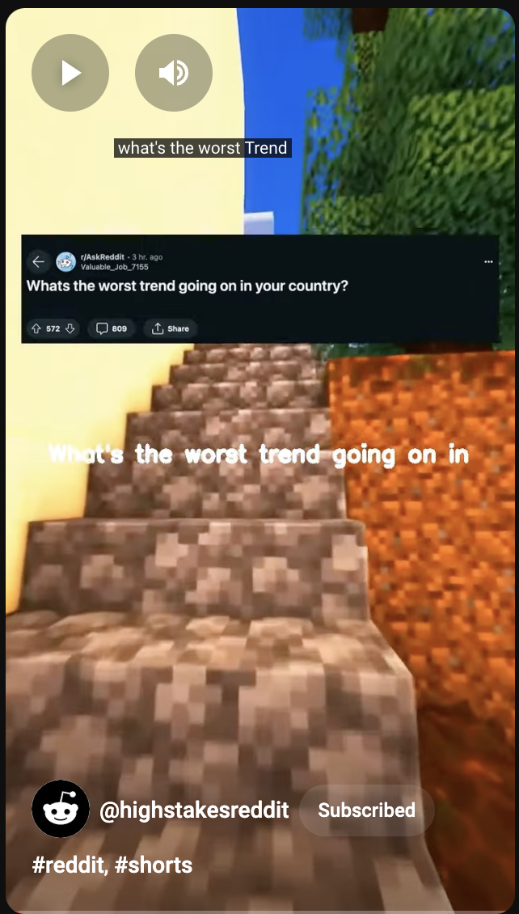

    
    
    

# Overview

This project aims to fully automate the process of creating Reddit narration short videos, similar to those popular on `TikTok, Instagram, and YouTube`. The automation covers every step of the video creation process detailed below: 

`searching for story` -> `grabbing comments` -> `comment scoring algo` -> `creating tts (text to speech)` -> `generating post image` -> `rendering video` -> `subtitling video` -> `uploading to youtube`

A detailed blog post with the logic can be found [here](https://meriedith.com/posts/reddit/).

# Setup

1. In your project directory, run: `git clone https://github.com/meeeeredith/videogenerator.git`
2. create the directory called `assets`
3. create the directory called `youtube`
4. in the assets directory, move `silence.mp3` into it
5. in the assets directory, find and download background footage. 

to find background footage that is non-copyright, you can find it [here](https://www.youtube.com/results?search_query=minecraft+parkour+footage+no+copyright), download it [here](https://downloaderto.com/engf/), and edit the dimensions [here](https://canva.com).  
--

6. pip install requirements.txt
7. python main.py
8. for automatic youtube uploading, you must sign up for the google cloud api. do that.
9. ready to upload videos will be located in the `youtube` directory.

# Tutorial coming soon!
